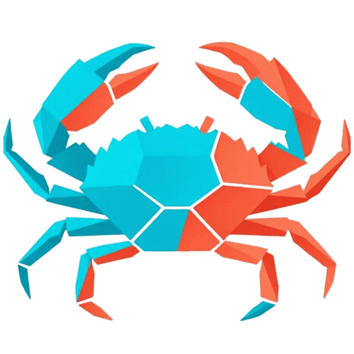
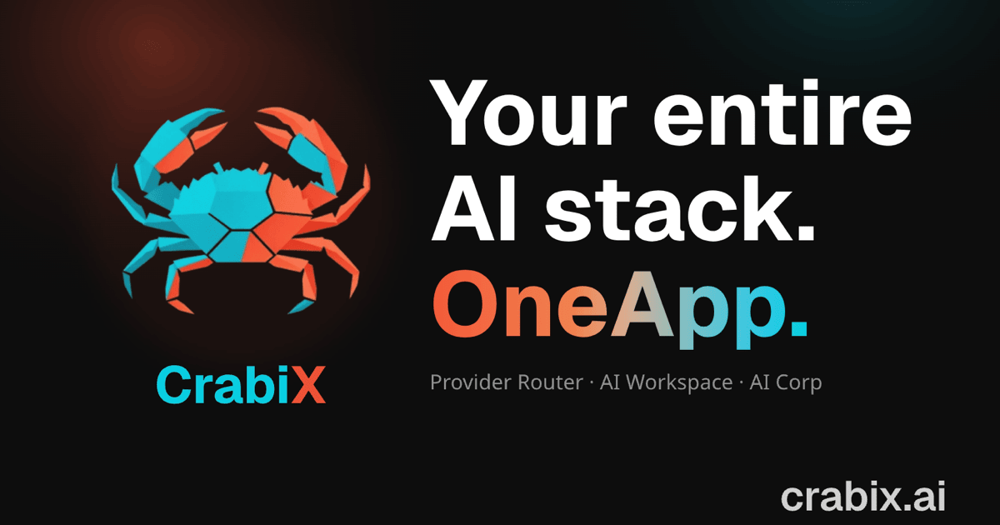
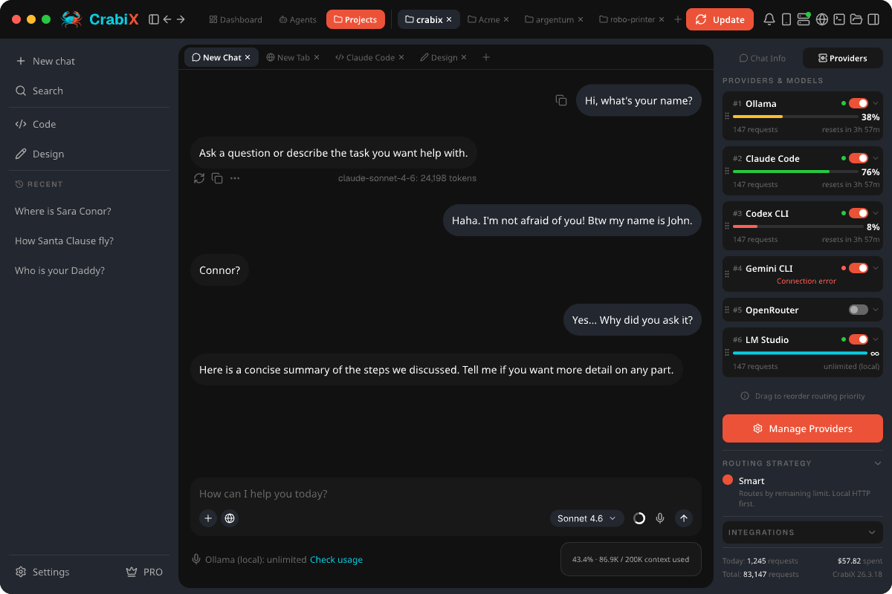
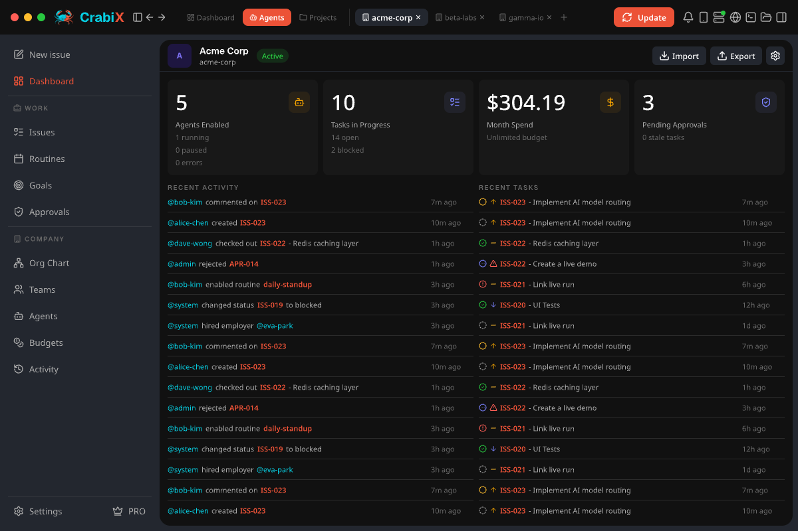
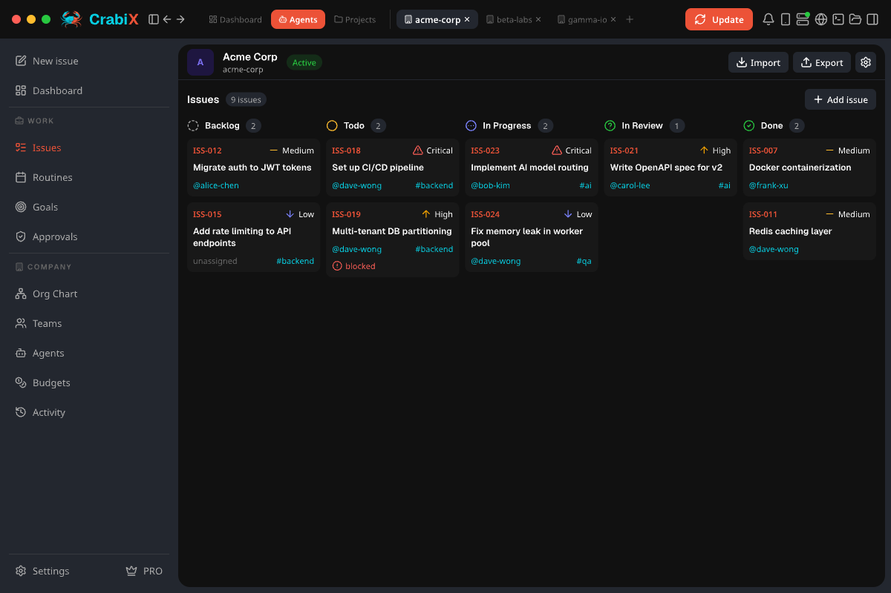
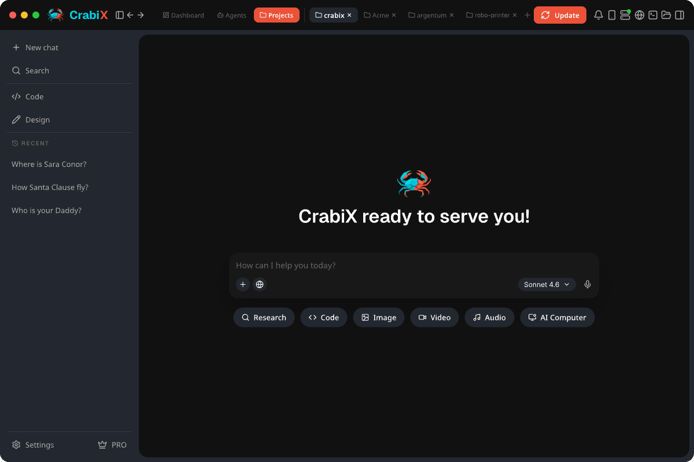

<p align="center">
  <a href="https://crabix.ai">
    
  </a>
</p>

<h1 align="center">CrabiX</h1>

<p align="center">
  Local AI router and AI workspace for developers.
  One localhost endpoint for your providers, local models, coding tools, agents, MCP, Skills, plugins, and AI Corp.
</p>

<p align="center">
  <a href="https://crabix.ai"><strong>Website</strong></a>
  |
  <a href="https://crabix.ai/download"><strong>Downloads</strong></a>
  |
  <a href="https://crabix.ai/llms.txt"><strong>LLM context</strong></a>
  |
  <a href="https://discord.gg/XTzppGXdNQ"><strong>Discord</strong></a>
</p>

<p align="center">
  <a href="https://crabix.ai"></a>
  <a href="https://crabix.ai/download"></a>
  <a href="LICENSE"></a>
</p>

<p align="center">
  <a href="https://crabix.ai/download/macos/aarch64/latest"></a>
  <a href="https://crabix.ai/download/macos/x86_64/latest"></a>
</p>

<p align="center">
  <a href="https://crabix.ai/download/windows/x86_64/latest"></a>
  <a href="https://crabix.ai/download/windows/aarch64/latest"></a>
  <a href="https://crabix.ai/download/linux/x86_64/appimage/latest"></a>
  <a href="https://crabix.ai/download/linux/x86_64/deb/latest"></a>
  <a href="https://crabix.ai/download/linux/x86_64/rpm/latest"></a>
</p>



## What This Repository Is

This is the public CrabiX repository for product information, release/download guidance, security reporting, legal links, community entry points, and agent-readable facts.

The desktop application source is not published here at this stage. Public download facts are served through [crabix.ai/download](https://crabix.ai/download) and the stable release metadata feeds.

CrabiX's first public early release is live. Signed desktop builds are served through canonical crabix.ai download URLs backed by releases.crabix.ai, and the release feed is the source of truth for currently published platform artifacts. Do not infer customer counts, testimonials, production usage numbers, benchmark claims, or enterprise adoption claims that are not stated on [crabix.ai](https://crabix.ai).

## What CrabiX Does

CrabiX exposes one OpenAI-compatible endpoint on your machine:

```text
http://localhost:3721/v1
```

Point Cursor, VS Code, Continue, Claude Code, Codex, Cline, OpenCode, custom scripts, or local model workflows at that endpoint. CrabiX routes requests through the providers and local models you own, applies routing strategy and fallback, and keeps the control plane local.

Core product principles:

- Local-first control plane.
- User-owned providers, subscriptions, API keys, and local models.
- No token markup.
- One endpoint for many tools.
- Transparent provider routing, fallback, and usage visibility.
- Workspace, agents, MCP, Skills, plugins, and AI Corp on the same local backend.

## Download Status

The canonical public download hub is:

```text
https://crabix.ai/download
```

Machine-readable release metadata:

```text
https://crabix.ai/release-feed.json
https://crabix.ai/.well-known/release-feed.json
https://releases.crabix.ai/channels/stable/latest.json
```

Canonical platform URLs:

| Platform | Asset | Status |
| --- | --- | --- |
| macOS Apple Silicon | `.dmg` | `https://crabix.ai/download/macos/aarch64/latest` |
| macOS Intel | `.dmg` | `https://crabix.ai/download/macos/x86_64/latest` |
| Windows x64 | installer | `https://crabix.ai/download/windows/x86_64/latest` |
| Windows ARM | installer | `https://crabix.ai/download/windows/aarch64/latest` |
| Linux AppImage | `.AppImage` | `https://crabix.ai/download/linux/x86_64/appimage/latest` |
| Debian / Ubuntu | `.deb` | `https://crabix.ai/download/linux/x86_64/deb/latest` |
| Fedora / RHEL | `.rpm` | `https://crabix.ai/download/linux/x86_64/rpm/latest` |

Platform URLs resolve only when the matching signed artifact is present in the stable release channel. Do not infer unavailable artifacts, checksums, ratings, download counts, or testimonials from planned platform support.

See [docs/downloads.md](docs/downloads.md) for the release and verification plan.

## Product Map

| Layer | What it gives you |
| --- | --- |
| Provider Router | 13 routing strategies, combo models, fallback, health, latency, local OpenAI-compatible API |
| Cost and Provider Dashboard | One view of provider status, limits, latency, usage, and routing policy |
| AI Workspace | Chat, projects, terminal, browser preview, files, Git, design context, tools, and agents |
| `crabix launch` | Start 15 supported coding-tool integrations through the CrabiX gateway without hand-editing each config |
| MCP, Skills, Plugins | External tools, reusable instructions, installable bundles, and up to 16 live MCP sessions per workspace scope on Pro |
| CLI / Service Mode | Headless gateway and agent workflows from the terminal |
| AI Corp | Companies, teams, AI employees, goals, issues, routines, approvals, budgets, and activity |
| CrabiX Link | Trusted cross-device access through scoped pairing |

## Screenshots

| Provider dashboard | Agents dashboard |
| --- | --- |
|  |  |

| Agent issues | Projects |
| --- | --- |
|  |  |

## Pricing

CrabiX has two public plans:

| Plan | Price | Best for |
| --- | --- | --- |
| Free | `$0` | Core routing, localhost endpoint, Smart + RoundRobin routing, chat/workspace basics, provider dashboard, basic agent runtime, basic MCP with up to 2 live sessions |
| Pro | `$19/month` | All routing strategies, combo models, expanded MCP config/imports, Skills, plugins, background agents, AI Corp automation, `crabix launch`, Git/design/preview workflows, extended stats, voice, CrabiX Link |

CrabiX does not add token markup. You pay providers directly through your own subscriptions, API keys, and local model runtimes. Paid CrabiX purchases are handled by Paddle as merchant of record, with refund terms at [crabix.ai/refund](https://crabix.ai/refund).

## Security And Privacy

CrabiX is local-first. API keys, provider credentials, prompts, responses, project files, chat history, MCP config, and routing config are intended to stay on your machine unless you send data to a selected provider, support channel, or explicit sharing/sync feature.

Important nuance: local-first does not mean every model runs locally. Cloud providers still receive prompts when you route to a cloud provider. Use local providers such as Ollama or LM Studio when you want inference to stay on device.

Security reports: read [SECURITY.md](SECURITY.md) and email [support@crabix.ai](mailto:support@crabix.ai). Please do not open public GitHub issues for vulnerabilities.

## Links For Humans And Agents

- Website: [crabix.ai](https://crabix.ai)
- Downloads: [crabix.ai/download](https://crabix.ai/download)
- Release feed: [crabix.ai/release-feed.json](https://crabix.ai/release-feed.json)
- Releases: [crabix.ai/releases](https://crabix.ai/releases)
- LLM context: [crabix.ai/llms.txt](https://crabix.ai/llms.txt)
- Full LLM context: [crabix.ai/llms-full.txt](https://crabix.ai/llms-full.txt)
- Agent feed: [crabix.ai/agent-feed.json](https://crabix.ai/agent-feed.json)
- Product docs in this repo: [docs/README.md](docs/README.md)
- Security model: [docs/security-local-first.md](docs/security-local-first.md)
- Legal: [Terms](https://crabix.ai/terms), [Privacy](https://crabix.ai/privacy), [Refund](https://crabix.ai/refund)

## Community

- Discord: [discord.gg/XTzppGXdNQ](https://discord.gg/XTzppGXdNQ)
- X: [@crabix_ai](https://x.com/crabix_ai)
- YouTube: [@crabix_ai](https://youtube.com/@crabix_ai)
- Facebook: [CrabiX](https://www.facebook.com/people/CrabiX/61590486493714/)
- Instagram: [@crabix_ai](https://www.instagram.com/crabix_ai)
- LinkedIn: [crabix-ai](https://www.linkedin.com/in/crabix-ai)
- TikTok: [@crabix_ai](https://www.tiktok.com/@crabix_ai)
- Threads: [@crabix_ai](https://www.threads.com/@crabix_ai)
- Reddit: [r/Crabix](https://www.reddit.com/r/Crabix/)
- Telegram channel: [t.me/crabix_ai](https://t.me/crabix_ai)
- Telegram chat: [t.me/crabix_ai_chat](https://t.me/crabix_ai_chat)

## Company

CrabiX is operated by VISIONER PTE. LTD., UEN 202314121N, Singapore.

Support: [support@crabix.ai](mailto:support@crabix.ai)

## License

This repository contains proprietary product materials, brand assets, screenshots, and release metadata. See [LICENSE](LICENSE).
